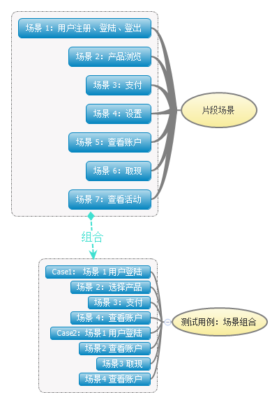

# TestCase-Selenium
Selenium TestCase Wukong
### 分类  
1. specialSale  
	a. 所有对象和它们的属性（文本、数值）  
	b. 各个对象的事件（click等）
2. mainpage  
3. task  
4. userCenter  

####测试框架  
1. 控件-页面-测试用例
2. 场景片段-场景

  
 
 使用XML存储每个页面元素的ID（或者class名字或者xpath路径）和属性。  
 使用XML存储每一个测试场景片段。  
 使用XML存储场景组合的测试用例。  
 每个产品存为一个XML文件。  
 ProductName_ProductCode.XML

 特卖页XPath分析  
 根：html/body/div[1]  
 特卖产品：div class="n-top"   
    html/body/div[1]/div[x]  
    产品名字：     html/body/div[1]/div[x]/a/div[1]/p/span[1]  
    期数：        html/body/div[1]/div[x]/a/div[1]/p/span[2]  
    预期年化收益率：html/body/div[1]/div[x]/a/div[3]/p  
    封闭期：       html/body/div[1]/div[x]/a/div[4]/p[1]/span  
    起投：         html/body/div[1]/div[x]/a/div[4]/p[2]/span  
    限购：         html/body/div[1]/div[x]/a/div[4]/p[3]/span  
    马上加入：      html/body/div[1]/div[x]/div/a  

因为有新手包的存在，所以对于已经购买过产品的用户和新用户同一个产品的XPath：html/body/div[1]/div[x]中的x会不同。  
解决办法：
  1. 针对不同情况的用户写固定的XPath  
  2. 通过某个已知的、具有唯一特性的节点（比如封闭期或者收益率）来获取它的父节点，然后就能获取同一产品的其他节点。  
比如：封闭期21天的节点   
`html/body/div[1]/div[1]/a/div[4]/p[1]/span`  
可以通过  
`driver.find_elements_by_xpath("//span[b[text()='21']]")`  
定位到。
产品的节点可以通过`driver.find_elements_by_xpath("//div/a/div/p/span[b[text()='21']]")`

 /html/body/div[1]/div[3]  